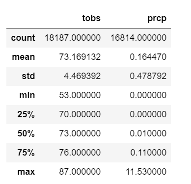
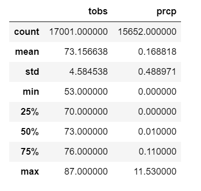
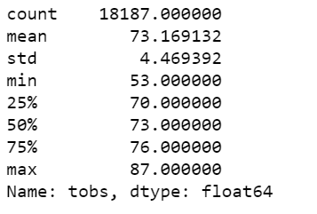
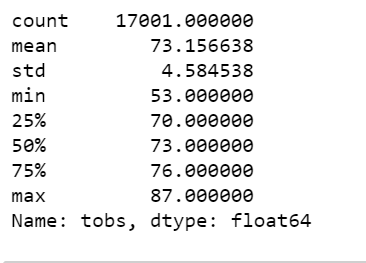
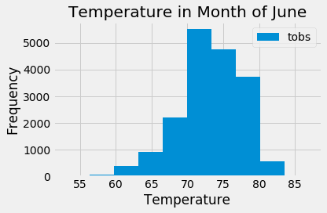
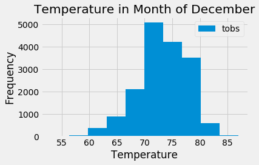
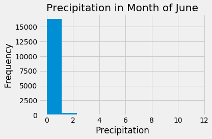
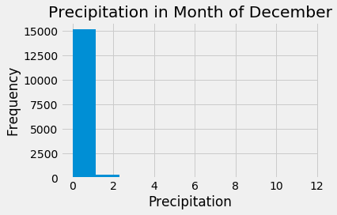

# surfs_up
# Module 9 challenge
To solve this challenge we used sqlalchamy to query sqlite database and pandas to plot the information in python. Do get the results used functions as below:
```
def key_stat_data(start, end):
    '''
    This function get temperature information from measurement between specified start and end date.
    Returns data frame
    '''
    try:
        results = session.query(Measurement.tobs, Measurement.prcp).filter(Measurement.date >= start).filter(Measurement.date <= end).all()
        stat_data_df = pd.DataFrame(results, columns=['tobs', 'prcp'])
        return stat_data_df
    except:
        print('Error in getting temperature information from measurement')
        return None
        

def get_min_max_years():
    '''
    This function gets start and end year from Measurement
    '''
    try:
        results = session.query(func.min(Measurement.date), func.max(Measurement.date)).all()
        return results[0][0].split('-')[0], results[0][1].split('-')[0]
    except:
        print('Error in getting min or max date from measurement')
        return None
        

def get_stat_for_month(mon_val):
    '''
    This will get stat for a specified month for all years and return dataframe with information
    '''
    if len(mon_val) != 2:
        print('Error in month format')
        return None
    try:
        year_range = get_min_max_years()
        start = f'{year_range[0]}-{mon_val}-01'
        end = f'{year_range[1]}-{mon_val}-30'
        return key_stat_data(start, end)
    except:
        print('Error in getting temperature information from measurement')
        return None
        
```
### Analysis
As seen in fligures below for temperature and precipitation. As Hawaii has temp same whole year so its hard to point out difference
* Number of data points are more in June than December.
* Mean temperature/precipitaition for all the years from 2010 to 2017 is almost same for both December and June.
* Maximum frequency of temperature is for both month of December and June is between 70-75 degrees.
#### June Stat

#### December Stat
 
### Average June Temperature for all stations

### Average December Temperature for all stations

### Average June Temperature for all stations histragram

### Average December Temperature for all stations histagram

### Average June Precipitation for all stations

### Average December Precipitation for all stations

